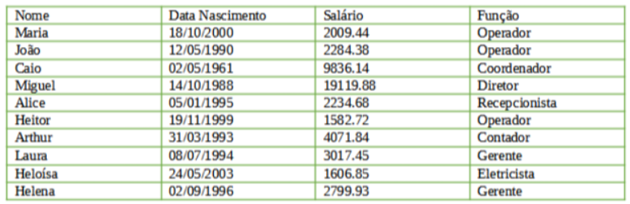

# TestePratico-Iniflex
Este repositório é destinado a resolver o teste pratico do processo seletivo para Desenvolvedor de Software Júnior - Área: Contábil/Fiscal

# Index:
* [Descrição](#descrição)
* [Solução](#solução)
    - [Estrutura do projeto](#estrutura-do-projeto)
    - [Tecnologias](#tecnologias)
    - [Execução](#execução)
    - [Decisões de Projeto](#decisões-do-projeto)

# Descrição:

## TESTE PRÁTICO PROGRAMAÇÃO. 

Considerando que uma indústria possui as pessoas/funcionários abaixo:



Diante disso, você deve desenvolver um projeto java, com os seguintes requisitos: 
1. Classe Pessoa com os atributos: nome (String) e data nascimento (LocalDate).
2. Classe Funcionário que estenda a classe Pessoa, com os atributos: salário (BigDecimal) e função (String). 
3. Deve conter uma classe Principal para executar as seguintes ações: 
    01. Inserir todos os funcionários, na mesma ordem e informações da tabela acima. 
    02. Remover o funcionário “João” da lista. 
    03. Imprimir todos os funcionários com todas suas informações, sendo que: 
        * informação de data deve ser exibido no formato dd/mm/aaaa; 
        * informação de valor numérico deve ser exibida no formatado com separador de milhar como ponto e decimal como vírgula. 
    04. Os funcionários receberam 10% de aumento de salário, atualizar a lista de funcionários com novo valor. 
    05. Agrupar os funcionários por função em um MAP, sendo a chave a “função” e o valor a “lista de funcionários”. 
    06. Imprimir os funcionários, agrupados por função. 
    08. Imprimir os funcionários que fazem aniversário no mês 10 e 12. 
    09. Imprimir o funcionário com a maior idade, exibir os atributos: nome e idade. 
    10. Imprimir a lista de funcionários por ordem alfabética. 
    11. Imprimir o total dos salários dos funcionários. 
    12. Imprimir quantos salários mínimos ganha cada funcionário, considerando que o salário mínimo é R$1212.00. 

## Orientações gerais: 
* você poderá utilizar a ferramenta que tem maior domínio (exemplos: eclipse, netbeans etc); 
* após finalizado o desenvolvimento, exportar o projeto e encaminhar o link do seu teste aqui mesmo na etapa Mão na Massa 🖐. Basta Colar o link ainda aqui nessa etapa. 
* Assim que recebermos seu projeto desenvolvido, será agendada uma entrevista com nosso time técnico para avaliação. Esperamos que você use todo seu conhecimento e criatividade nesse teste. Caso você não souber resolver determinado requisito comente no código que aquele item você não sabe como desenvolver, e vá para o próximo. Avaliaremos o que você conseguiu desenvolver e como foi desenvolvido. Boa sorte!

# Solução:

A aplicação foi desenvolvida utilizando Java puro com Maven, seguindo uma abordagem simples e direta, conforme o escopo proposto.

Todas as operações são realizadas em memória, sem uso de banco de dados, conforme recomendado no enunciado.

## Estrutura do Projeto
```
src/main/java/br/com/gabriel/empresa 
│ 
├── model 
│   ├── Person.java 
│   └── Employee.java 
│ 
├── util 
│   └── Formatter.java 
│ 
└── Main.java
```

## Tecnologias
- Java 17
- Maven
- API padão do java:
    - `java.time`(datas)
    - `BigDecimal`(valores monetários)
    - `Streams` (manipulações de coleções)

## Execução
### Compilar o projeto:
``` 
mvn clean compile
```

### Executar
```
mvn exec:java -D"exec.mainClass"="br.com.gabriel.empresa.main"
```

## Decisões do Projeto
- Uso de BigDecimal para evitar erros de precisão em valores monetários
- Uso de LocalDate para manipulação segura de datas
- Separação em camadas simples (model e util)
- Uso de Streams para operações como:
    - agrupamento
    - ordenação
    - filtragem
- Saída formatada com printf, simulando um relatório estruturado

## Funcionalidades Implementadas
- Inserção dos funcionários
- Remoção do funcionário "João"
- Impressão formatada (datas e valores)
- Aplicação de aumento de 10%
- Agrupamento por função
- Listagem de aniversariantes (Outubro e Dezembro)
- Identificação do funcionário mais velho
- Ordenação alfabética
- Soma total dos salários
- Cálculo de salários mínimos por funcionário


## Observações

O projeto foi mantido propositalmente simples, priorizando:

- clareza
- legibilidade
- aderência ao escopo

Sem uso de frameworks adicionais ou banco de dados.